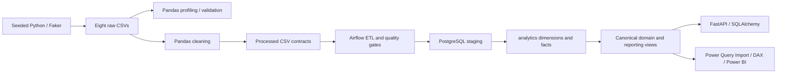

# Architecture

## Data flow

The DAG starts from processed CSVs. Raw generation/profiling/cleaning are host
commands; the Airflow task named transform refreshes staging, not raw-file
cleaning. Tasks are extract → validate → transform → load → quality_check →
reporting_ready. A hash/size/mtime manifest protects against source changes
between tasks. Task retries, bounded exponential delays, timeouts, failure
callbacks and all-success dependencies block reporting after a failed gate.

## Storage and grains

`staging` contains eight text landing tables. The warehouse is implemented
inside `analytics`, alongside its views: six dimensions (date, customer,
vehicle, employee, dealership, service) and three facts (sale, stock snapshot,
repair order). The DDL creates two schemas; documentation that previously
referred to a separate empty warehouse schema was inaccurate.

FactSales has one sale ID. FactInventory has one vehicle/dealership/snapshot.
FactService has one repair order and unique appointment ID. The reporting service
detail view starts from every staging appointment and left joins an order;
its grain differs from the repair-order fact and includes cancelled/no-show/
scheduled appointments. Primary/natural keys, FKs, domain constraints and
filtered current-version indexes enforce contracts. See [dictionary](data_dictionary.md).

Sales/service/customer totals are aggregated independently. Avoid fact-to-fact
joins and joining by display names. Sales units/revenue/profit are signed for
returns; inventory is semi-additive over time; repeat customer counts are
non-additive across dealerships. Service cost/profit are unavailable, not zero.

## Transactions and operating boundaries

Host ETL validates before connecting, applies ordered DDL transactionally, and
refreshes staging/warehouse in one subsequent data transaction. Airflow's staging
and warehouse tasks use separate transactions; a successful staging refresh can
remain if warehouse loading fails. The quality gate runs after load commit;
it stops reporting_ready but does not roll back that already committed load.
Consumers should refresh only after a successful complete DAG run.

Full-refresh ETL truncates and rebuilds dimensions/facts and restarts surrogate
identities. SCD-shaped fields exist but incremental history preservation is not
implemented. Import every Power BI table from one stable ETL generation. The
DAG's max_active_runs=1 serializes its own runs, not arbitrary host ETL or
Power BI sessions; avoid concurrent writers/refreshes operationally.

## Runtime topology

Compose runs application PostgreSQL, isolated Airflow metadata PostgreSQL,
warehouse-init, airflow-init, FastAPI, Airflow API server, scheduler and DAG
processor on the analytics network. Two database volumes and an Airflow log
volume persist state. Processed files are read-only mounted into Airflow; code
is baked into images. Init jobs gate dependent service startup. App/Airflow
dependencies live in separate images. API runs as a non-root user.

PostgreSQL, API and Airflow UI ports bind to 127.0.0.1. Containers use postgres:5432;
host settings use published ports. Authentication for Airflow is distinct from
the currently unauthenticated, read-only API. HTTP route read-only behavior
does not imply the shared database login has SQL-enforced read-only permissions.

## Configuration, privacy and limitations

Environment variables supply credentials, pool settings and retry/timeout values.
Ignored .env is for local development only. Images exclude secrets/data. SQL
filters are bound parameters; API database exceptions return sanitized 503s.
Do not expose the API or use actual customer records without authorization,
access controls and a dedicated least-privilege database role. Power BI excludes
customer names/email/phone but the synthetic customer API exposes display names.

Dependency version ranges and image tags are not immutable lockfiles. Repeated
data generation is deterministic for the same seed and dependency versions,
not guaranteed across arbitrary Faker upgrades. No cloud deployment, CI runtime
integration job, performance SLA, RLS or forecast CLV is claimed.

[Final review](final_review.md) records tests versus blocked runtime checks.
