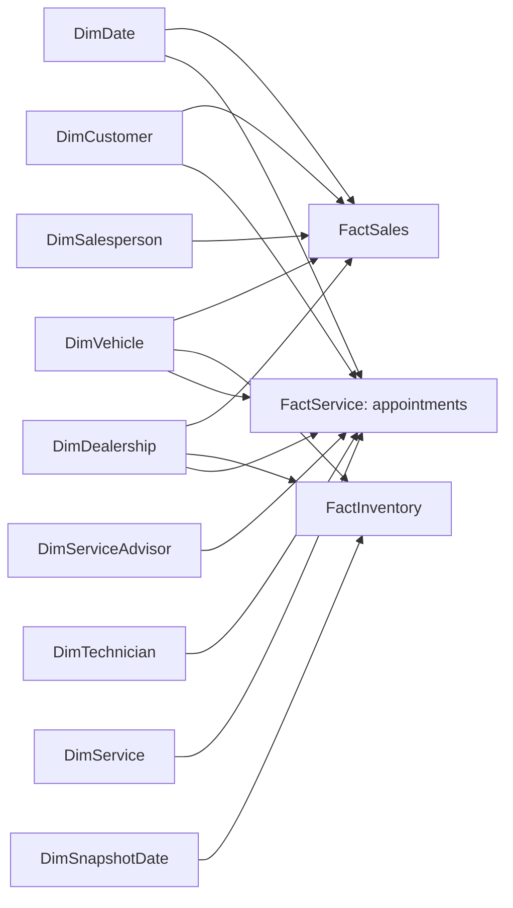

# PostgreSQL to Power BI star schema

## Design and source inventory

Use Import mode and a full refresh at the current scale. All tables in one
refresh must come from the same completed ETL generation: the ETL truncates and
rebuilds dimensions with `RESTART IDENTITY`, so surrogate keys are not stable
between refreshes. Incremental/composite refresh is not supported until stable
keys, historical dimension versions and refresh consistency are implemented.
Never refresh while Airflow is replacing staging or warehouse data. Schedule
after `reporting_ready`, and prevent concurrent ETL for the whole import window.
The API and Power BI read PostgreSQL independently; Power BI does not ingest API
pages or raw CSVs.

| Model table | PostgreSQL source | Grain / unique key | Retained attributes and values |
|---|---|---|---|
| DimDate | analytics.dim_date, extended in Power Query | One calendar day / date_key | full_date, year, quarter, month number/name, day, weekday, ISO week/year, year-month label/sort |
| DimSnapshotDate | Reference of DimDate | One calendar day / date_key | Independently selected inventory snapshot date |
| DimCustomer | analytics.dim_customer | One customer version / customer_key | customer_id, customer_type, city, state, postal_code, customer_since_date, version dates, is_current; exclude names, email and phone by default |
| DimVehicle | analytics.dim_vehicle | One vehicle / vehicle_key | vehicle_id, make (Brand), model, model_year, body_type, fuel_type, condition, color; VIN restricted detail only |
| DimDealership | analytics.dim_dealership | One dealership / dealership_key | dealership_id, name, city, state, region, postal_code, opened_date |
| DimSalesperson | Role-filtered analytics.dim_employee | One employee version / employee_key | employee_id, display name, role, employment status, hire/effective dates; Sales Consultant role |
| DimServiceAdvisor | Role-filtered analytics.dim_employee | One employee version / employee_key | Same attributes; Service Advisor role |
| DimTechnician | Role-filtered analytics.dim_employee | One employee version / employee_key | Same attributes; Service Technician role |
| DimService | analytics.dim_service | One service type / service_key | service_type, service_category, is_active |
| FactSales | analytics.vw_sales_detail | One eligible transaction / sales_key; sale_id unique | sale_date_key, customer_key, vehicle_key, dealership_key, salesperson_key, channel/payment/status, units_sold, list_price, discount_amount, revenue, vehicle_cost, gross_profit |
| FactInventory | analytics.vw_inventory_detail | One vehicle/dealership/snapshot / vehicle_key + dealership_key + snapshot_date_key | inventory_id, snapshot_date_key, acquired_date, derived acquired_date_key, vehicle_key, dealership_key, status, inventory_units/value, age, aging bucket/sort, is_slow_moving |
| FactService | analytics.vw_service_appointment_detail | One appointment / appointment_id | appointment_date_key, customer_key, vehicle_key, dealership_key, service_advisor_key, service_key, nullable technician_key/order_id; appointment flags, payer, open/promised/completed dates and keys, repair_order_quantity, revenue components, turnaround/on-time, unavailable cost/profit flags |

`FactService` also receives order_status and derived date roles from the
read-only projection in power_query.md. `FactService` is a semantic table name, not a direct import of
`analytics.fact_service`. The source view left joins the unique repair order to
each appointment. Its one-to-zero-or-one order relationship is already resolved
in PostgreSQL; no second repair-order fact or fact-to-fact relationship is loaded.
The raw repair-order fact would lose non-completed appointments and distort the
completion denominator.

Payment type, channel, sale status, inventory status and payer type are small
degenerate attributes on their own fact. No speculative many-to-many bridges or
new database tables are required. Inventory has no customer/employee/service
foreign key, so those slicers deliberately do not affect inventory.

## Relationship registry

Every row below has cardinality **one-to-many (1:*)** (dimension is the one side), cross-filter
direction **Single**, dimension → fact. All key columns use Whole Number / Int64.
Inactive relationships exist in the model but do not propagate filters by default.

| One-side table.column | Many-side table.column | Active? | Date / employee role |
|---|---|---|---|
| DimDate.date_key | FactSales.sale_date_key | Yes | Sale recognition date |
| DimCustomer.customer_key | FactSales.customer_key | Yes | Purchasing customer version |
| DimVehicle.vehicle_key | FactSales.vehicle_key | Yes | Sold vehicle |
| DimDealership.dealership_key | FactSales.dealership_key | Yes | Selling dealership |
| DimSalesperson.employee_key | FactSales.salesperson_key | Yes | Sales consultant |
| DimSnapshotDate.date_key | FactInventory.snapshot_date_key | Yes | Stock snapshot date |
| DimSnapshotDate.date_key | FactInventory.acquired_date_key | No | Acquisition-date analysis |
| DimVehicle.vehicle_key | FactInventory.vehicle_key | Yes | Inventory vehicle |
| DimDealership.dealership_key | FactInventory.dealership_key | Yes | Stock-holding dealership |
| DimDate.date_key | FactService.appointment_date_key | Yes | Appointment cohort |
| DimDate.date_key | FactService.completed_date_key | No | Revenue completion date |
| DimDate.date_key | FactService.opened_date_key | No | Repair-order opening date |
| DimDate.date_key | FactService.promised_date_key | No | Promised completion date |
| DimCustomer.customer_key | FactService.customer_key | Yes | Service customer version |
| DimVehicle.vehicle_key | FactService.vehicle_key | Yes | Serviced vehicle |
| DimDealership.dealership_key | FactService.dealership_key | Yes | Servicing dealership |
| DimServiceAdvisor.employee_key | FactService.service_advisor_key | Yes | Appointment advisor |
| DimTechnician.employee_key | FactService.technician_key | Yes | Order technician (nullable) |
| DimService.service_key | FactService.service_key | Yes | Appointment service type |
| DimDate.full_date | DimCustomer.customer_since_date | No | Customer acquisition cohort; Date types on both sides |

The diagram shows active paths only. Do not activate an employee-dealership
relationship: the PostgreSQL employee FK is not a semantic relationship here.
Otherwise Dealership can filter Service through both employee and direct paths.
Retain dealership attribution on facts, not employee dimension filtering. Do not
connect Date to SnapshotDate, facts to facts, or the employee copies to each other.
Disable automatic relationship detection; create the registry explicitly. With
single direction, a salesperson selection affects sales only and does not prune
customers or other facts. Use dimensions for shared slicers and measure-based
slicer availability later, rather than global bidirectional filtering.

## Date policy

Mark both date tables as date tables using `full_date` (Date type, unique,
non-null, contiguous). Extend their range to complete calendar years spanning
all imported event dates, including promised dates and customer registration.
The warehouse calendar is contiguous but ends at observed dates and does not
explicitly include promised dates; the Power Query extension addresses this.
Disable Auto date/time. Sort month names by month number and year-month labels
by `year * 100 + month`. PostgreSQL `week_of_year` is ISO week; derive ISO year
as the year of the week's Thursday, not blindly calendar year. Fiscal periods
remain unspecified pending business approval.

DimDate is the shared sales/service reporting calendar. Appointment counts,
cancellations, no-shows and completion rate use the active appointment date.
Service revenue should use completion date for financial reporting, activating
the inactive completed-date relationship with `USERELATIONSHIP` in the future
measure; this overrides the appointment relationship for that calculation.
Label appointment-cohort revenue separately, since existing service aggregate
views group revenue by appointment date. Opening/promised-date measures use
their own inactive role. Do not turn timestamps into dates by an implicit UTC
conversion: PostgreSQL currently stores naive local timestamps and has no
dealership timezone metadata. Preserve their supplied business dates.

Use the inactive registration relationship only in New Customers/cohort
measures. Use an explicit last selected reporting date for as-of CLV and recency,
removing the lower date bound to accumulate qualifying history. Inactive
relationships are not security paths; RLS for a future report must use active
dealership-to-fact paths, with appropriate dimension access handling.

SnapshotDate is independent to prevent a monthly sales range from summing
inventory over time. Require one snapshot for stock measures, or select the
latest available snapshot on/before the selected as-of date and clearly label it.
Select that snapshot consistently across dealerships, not one date per vehicle.
Missing dealership stock at that snapshot is not silently forward-filled.
Never sum inventory across snapshots; do not average per-snapshot averages.

## KPI and privacy contract

Sales units/revenue/cost/profit are already signed in `vw_sales_detail`:
Completed positive, Returned negative, Cancelled excluded. Do not multiply by
units again. Sum units/revenue/profit, then compute ASP = Revenue / Units and
Gross Margin = Gross Profit / Revenue; return blank on zero denominators.
Do not average row margins or use distinct vehicle count as Units Sold.

Inventory measures use one snapshot and the source's on-hand units:
Inventory Value = sum inventory_value; average age is unit-weighted;
slow-moving units/value use is_slow_moving (>90 days). Buckets are 0–30,
31–60, 61–90, 91–120, and 120+ (the last means strictly >120, not >=120).
Sort bucket labels by aging_bucket_sort and preserve source eligibility rules.
The current view includes every inventory_status (each row has one unit);
status exclusions are not implicit. An Available-only measure requires an
explicit status filter and a distinct label, and must reconcile on that basis.

Appointments = sum appointment_count; Completion Rate = sum
completed_appointment_count / sum completion_eligible_count. Completed,
Cancelled and No Show are eligible; Scheduled is excluded. Repair orders are
distinct non-null service_order_id; average repair order = revenue / that count
using the same date role and payer filters. Warranty/Internal revenue must stay
separately selectable. Missing service_cost/profit remain blank, never zero.

Total Customers counts dimension customer IDs, independent of transaction-date
filters unless a cohort measure explicitly activates registration. Qualifying
Customers / Repeat Customers count qualifying sales and completed service
interactions within the chosen window, >=1 / >=2 respectively; count the same
customer once across both facts. Returned-only activity is not a new purchase;
return amounts still reverse revenue. Repeat Rate uses qualifying customers,
not every registered customer. Service frequency counts completed orders per
customer in a documented observation period. The existing customer scorecard
defines New Customer as exactly one lifetime interaction and counts eligible
returns in sales transaction counts; registration-cohort New Customers and
period-repeat customers are distinct proposed measures, not aliases for those
static fields. Their definitions must be labeled and approved before DAX work.
Distinct customers are non-additive
across dealerships. Lifetime customer value is currently **interim revenue-based
CLV**, signed sales revenue plus completed service revenue through the selected
as-of date; profit-based CLV is unsupported until service costs exist.

Do not import `vw_customer_value` monetary totals into DimCustomer as measures:
they are current/all-history summaries, not responsive to dealership, vehicle
or period filters. If current static segment labels are later needed, merge only
labels + as_of_date + clv_method by unique current customer_id, disclose their
scope, and validate one-to-one cardinality. Do not present static segments as
dynamic period segments. Similarly, `vw_dealership_performance` is an independent
scorecard (lifetime sales/service plus latest stock), not a star fact to append
or join. Use it for reconciliation, not duplicate revenue.

Hide surrogate keys, version administration and raw additive values from report
authors where explicit measures are intended. Retain IDs for authorized detail;
default customer labels use customer_id, not names. Postal codes are Text, not
numeric. Restrict VIN/employee detail as appropriate. No RLS access mapping is
available today; do not claim report security has been implemented.

## Current limitations and acceptance

The customer/employee schema permits versioning, but the ETL is a current-state
full rebuild, not historical SCD2. Keep all dimension key rows if history is
introduced; filtering only is_current would orphan old facts. No targets,
currencies, timezone rules, service lines, open-order workload or authoritative
service costs exist. Returned sale rows have no separate return-event link/date;
the source sale_date is the only available recognition date. These gaps must
remain visible and must not be filled with invented values in Power Query.

Validate each grain and relationship with model_validation.sql, then test future
model filters: shared Dealer/Vehicle affect all applicable facts; Customer
does not affect Inventory; each employee role affects only its fact; Snapshot
does not affect Sales/Service; completion-date revenue differs correctly from
appointment-date revenue; summaries reconcile under identical filter context.
This phase ends with the specification and source validation, without report
pages, a PBIX, DAX measure implementation or Power BI deployment.
